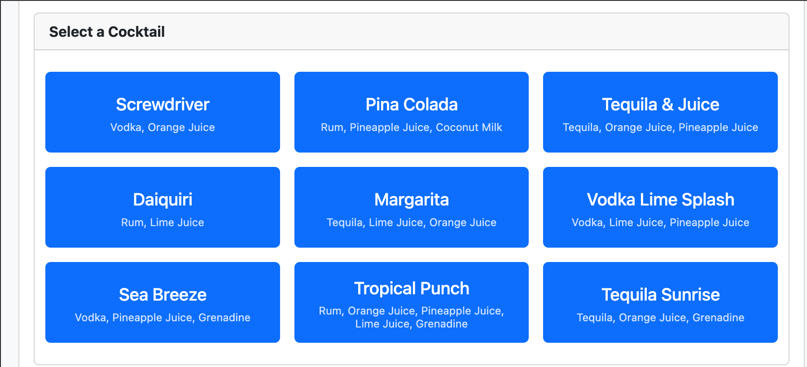
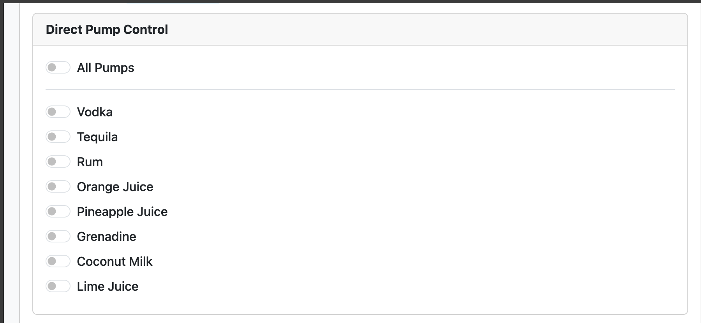
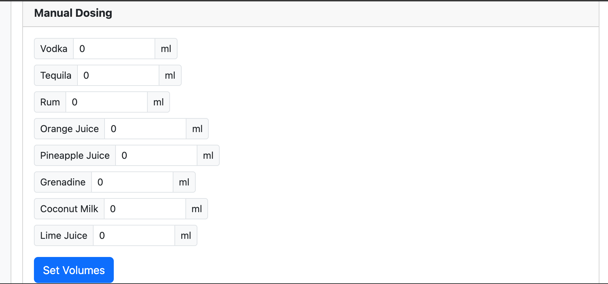
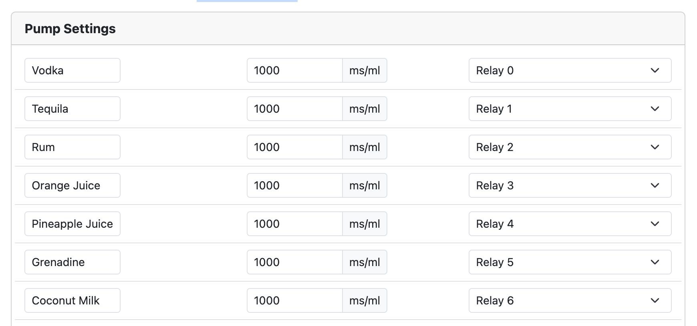
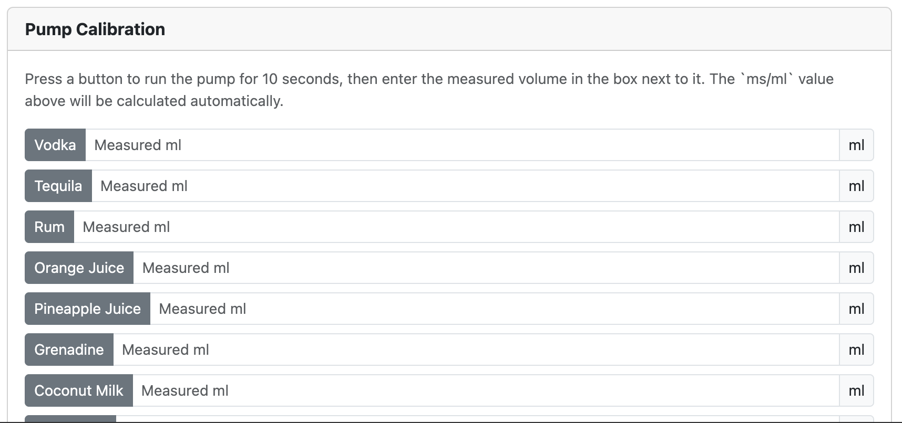
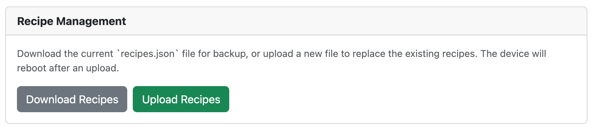

# Drink Crafter - Open Source Cocktail Mixer

Drink Crafter is an open-source project that turns an ESP32 and a relay module into a sophisticated, automated cocktail and drink mixing machine. It hosts its own Wi-Fi network and provides a web-based user interface accessible from any phone or computer to control pumps, manage settings, and run pre-defined recipes.

All settings, recipes, and web files are stored on the ESP32's flash memory, meaning it requires no internet connection to operate after the initial setup.


## Features

* **Standalone Operation:** Creates its own Wi-Fi Access Point. No internet required.

* **Flexible Hardware Profiles:** Easily configure for different boards, numbers of pumps, and pin layouts using build flags in `platformio.ini`.

* **Simplified Web UI:** Modern, responsive interface focused on making drinks.

* **Direct Pump Control:** Manually turn individual pumps on and off for testing and cleaning.

* **Pump Configuration:** Set custom names, calibration values (ms/ml), and relay assignments for each pump.

* **Read-Only Recipes:** The device loads all cocktail recipes from the `data/recipes.json` file at boot. To change recipes, you must edit this file and re-upload the filesystem.

* **Persistent Storage:** Pump settings and run counters are saved to the ESP32's flash memory and persist through reboots.

* **Run Statistics:** Counts the total number of drinks made and the number of runs for each individual recipe.

* **Secure Counter Reset:** A PIN-protected function to reset all run counters.

* **Live** Progress **View:** A modal pops up during a run to show the current step and a progress bar.

## Screenshots













## Releases & Installation

This project uses GitHub Actions for Continuous Integration and Deployment (CI/CD). On every new version tag (e.g., `v1.1.0`), a new release is automatically created with pre-compiled, all-in-one firmware binaries.

### Easy Installation (Recommended)

The easiest way to install Drink Crafter is by using the web flasher. This allows you to flash the firmware directly from your browser without needing to install any software.

[**Click here to open the Drink Crafter Web Flasher**](https://renebohne.github.io/drink_crafter/web_flasher.html)

### Manual Installation (for Developers)

If you want to compile the code yourself, follow the setup instructions below.

## Hardware Requirements

1. **ESP32 Development Board:** Any common ESP32 board will work (e.g., ESP32-DevKitC, Seeed Studio XIAO ESP32-C6).

2. **Relay Module:** A 5V relay module that can be controlled by the ESP32's 3.3V logic.

3. **Pumps:** Peristaltic pumps or other 5V/12V pumps suitable for food-grade liquids, along with appropriate power supply.

4. **Connecting Wires:** Standard Dupont-style wires.

> \[!TIP\]
> This is the board with ESP32 and eight relays that I use: LC-Relay-ESP-32-8R-D5 <https://www.amazon.de/dp/B0CZDQ9QRG>
> But the code is also prepared for the Seeed Studio Relay board if 6-channels are enough for your drink crafter robot: <https://wiki.seeedstudio.com/6_channel_wifi_relay/>

## Software Requirements

1. **Visual Studio Code:** The recommended code editor.

2. **PlatformIO Extension:** Must be installed in Visual Studio Code.

## Setup Instructions

### Step 1: Get the Project Files

Download or clone this project to your computer. Open the project folder in Visual Studio Code.

### Step 2: Download Offline Bootstrap Files

For the web interface to work without an internet connection, you need to download the Bootstrap library. From the root of the project folder, run the following commands in your terminal:

```bash
wget [https://raw.githubusercontent.com/twbs/bootstrap/v5.3.2/dist/css/bootstrap.min.css](https://raw.githubusercontent.com/twbs/bootstrap/v5.3.2/dist/css/bootstrap.min.css) -P data/
wget [https://raw.githubusercontent.com/twbs/bootstrap/v5.3.2/dist/js/bootstrap.bundle.min.js](https://raw.githubusercontent.com/twbs/bootstrap/v5.3.2/dist/js/bootstrap.bundle.min.js) -P data/
```

These commands will download the necessary files and place them directly into the `data` folder.

### Step 3: Configure Your Hardware Profile

Open the `platformio.ini` file. This file contains different hardware profiles (environments).

* For a standard 8-channel setup, use the `esp32dev_8_channel` environment.

* For the 6-channel XIAO C6 setup, use the `xiao_c6_6channel` environment.

You can select the active environment in the PlatformIO toolbar at the bottom of the VS Code window.

### Step 4: Upload the Filesystem to the ESP32

This step bundles all the files from the `data` folder and uploads them to the ESP32's flash memory.

1. Connect your ESP32 to your computer via USB.

2. In Visual Studio Code, open the PlatformIO sidebar.

3. Under **Project Tasks -> \[Your Chosen Environment\] -> Platform**, find and click on **Upload Filesystem Image**.

4. Wait for the process to complete.

**Note:** You must repeat this step every time you make a change to any file inside the `data` folder (e.g., editing `recipes.json`).

### Step 5: Upload the Main Program

This step compiles the C++ code and uploads it to the ESP32.

1. In the PlatformIO sidebar, under **Project Tasks -> \[Your Chosen Environment\]**, click on **Upload**.

2. PlatformIO will compile the code for your selected hardware and upload the firmware.

## Usage

### Connecting to the Drink Crafter

1. On your phone or computer, search for Wi-Fi networks.

2. Connect to the network named **`Drink-Crafter`**.

3. The password is **`12345678`**.

### Accessing the Web Interface

1. Once connected to the Wi-Fi, open a web browser.

2. Navigate to the address: **`http://192.168.4.1`**

3. The Drink Crafter control panel should load, and you can start mixing!

### Resetting Statistics

The "Settings" tab contains a section for statistics. To reset all counters to zero, click the "Reset All Counters" button. You will be prompted for a PIN.

* **PIN:** `0509`

## For Advanced Users: API Endpoints

The project includes a full OpenAPI 3.0 specification file (`openapi.json`) that formally describes all available API endpoints, parameters, and schemas. You can use this file with tools like Swagger UI for interactive API documentation or to generate client code for custom integrations.

* `GET /status`: Returns a large JSON object with the complete state of the device.

* `GET /recipes`: Returns the raw content of the `recipes.json` file.

* `PUT /recipes`: Replaces the `recipes.json` file and reboots the device.

* `GET /pump/{pumpIndex}/{state}`: Manually turn a pump on (1) or off (0).

* `POST /volumes`: Sets the volumes for a manual dosing run.

* `GET /start_dosing`: Starts a manual dosing run.

* `GET /run_recipe/{recipeIndex}`: Starts a specific recipe by its index.

* `GET /stop`: Stops any currently running recipe or manual dose.

* `POST /settings`: Updates the pump settings.

* `POST /reset_counters`: Resets all run statistics.

## Troubleshooting & Common Issues

* **Web page does not load or looks broken:** You likely forgot to upload the filesystem image after changing the HTML, CSS, or JS files. Run the **"Upload Filesystem Image"** task in PlatformIO.

* **Device is not working after changing hardware:** Make sure you have selected the correct environment in PlatformIO (e.g., `esp32dev_8_channel`) before clicking "Upload".

* **"Error: An Error has occurred while mounting LittleFS" in Serial Monitor:** This can happen on the very first upload. Try running "Upload Filesystem Image" first, then "Upload" the main program. If it persists, run the **"Erase Flash"** task in PlatformIO and then re-upload the filesystem and the program.

* **Recipes or settings are not saving:** Pump settings and run counters are saved automatically. Recipes are read-only and must be changed in the `data/recipes.json` file, followed by an "Upload Filesystem Image".

## Credits and Licensing

This project is open-source and builds upon the fantastic work of others.

* **ESP32 Arduino Core:** The underlying framework that allows the ESP32 to be programmed with the Arduino language.

  * **Copyright (c) 2015-2023 Espressif Systems (Shanghai) CO LTD**

  * Licensed under the [LGPL v2.1 License](https://github.com/espressif/arduino-esp32/blob/master/LICENSE).

* **Bootstrap:** The web interface is built using the Bootstrap framework.

  * **Copyright (c) 2011-2023 The Bootstrap Authors**

  * Licensed under the [MIT License](https://github.com/twbs/bootstrap/blob/main/LICENSE).

* **ArduinoJson:** This library is used for all JSON parsing and serialization on the ESP32.

  * **Copyright** (c) 2014-2023 Benoît Blanchon

  * Licensed under the [MIT License](https://github.com/bblanchon/ArduinoJson/blob/master/LICENSE.md).
